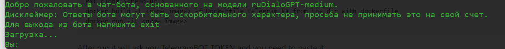
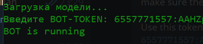
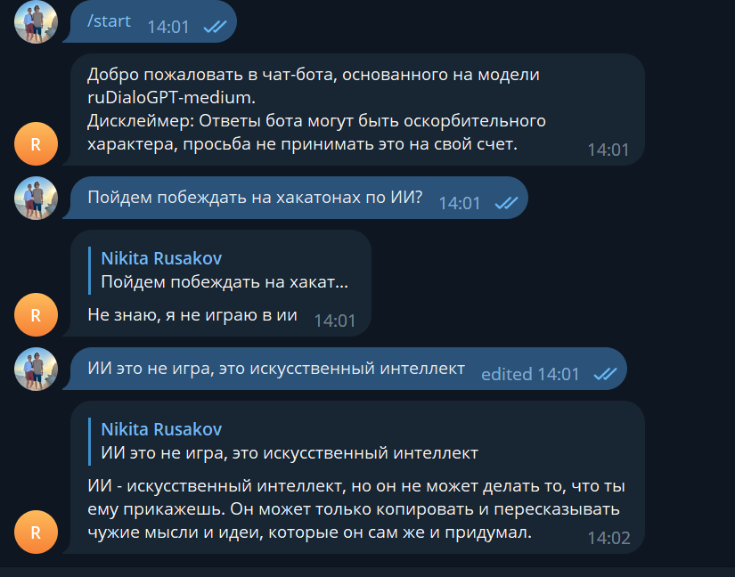

# FineTune_ruDialoGPT

## Description:
Fine-tune ruDialoGPT-medium using chat history from any Telegram conversation and implement an application interface using the Telegram Bot API to interact with the fine-tuned model. I've decided to use conversational data from the popular chat platform 'Двач' because it contains a vast number of messages, and it frequently includes highly toxic content. These reasons should significantly impact the final results.
The model was trained on data consisting of three messages of context and respons."

## Data processing
I collected all of the data using a Python script called prepare_messages.py. This script scrapes the data into a pandas DataFrame with columns: context_3, context_2, context_1, and response. Since I had a sufficient amount of data, I removed all rows that contained any empty columns. After it I comple the next ponts:
* remove urls
* remove special telegram symbols for text-style
* remove all english characters

## Data tokenization
The main idea was concate all dialogue turns in one row with special separation tokens. The concated turns looks like:  
  **\<sp1>context_3\<sp2>context_2\<sp1\>context_1\<sp2\>response\<sp1\>**  

## Fine tune model
Model trained only one epoch with batch_size = 8 on GPU google colab. The main reason of this parametrs is a lack of computer power. Model trained more than 3 hours with 3 evaluating on validation data.
Train dataset size > 100k. All details you can find in my [notebook](https://github.com/v4ndi/FineTune_ruDialoGPT/blob/main/src/Fine_Tune_ruDialoGPT.ipynb)

## How to try to interact with fine-tuned model
### Dowload model files
[google drive](https://drive.google.com/drive/folders/1O5sYA4oCDuU5241QvqXfTrsCR_GXGdK9?usp=sharing)
### Clone repo
```
git clone <hhtp/ssh>
```
After git clone find folder model and put folder epoch1_ruDialoGPT_dvach into the /model. It should look like this
```
/model/epoch1_ruDialoGPT_dvach
```
### Running bot in termial 
```
docker build -t <name_image> -f Dockerfile_bot ## from the dir with dockerfile
docker run -it <name_image>
```
  
### Running bot in telegram
```
docker build -t <name_image> -f Dockerfile_telegram ## from the dir with dockerfile
docker run -it <name_image>
```
After run it will ask you TelegramBOT TOKEN and you need to paste it.   
  
  


